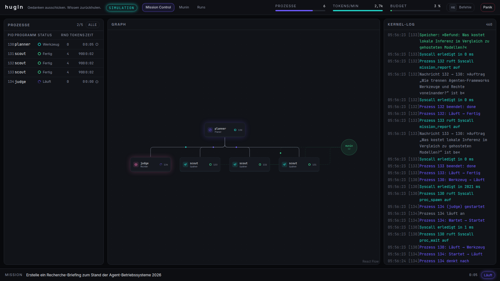

# hugin

<p align="center">
  
</p>

<p align="center">
  <a href="docs/media/demo.webm"><b>▶ 30-Sekunden-Demo (WebM)</b></a> ·
  <a href="docs/media/boot.png">Boot</a> ·
  <a href="docs/media/replay.png">Replay</a>
</p>

## Was ist hugin?

hugin ist ein lokal laufendes **agentisches Betriebssystem**: ein Python-Kernel führt KI-Agenten
als überwachte Prozesse aus — mit PID, Budget, Capabilities, Scheduler, IPC und einem
gemeinsamen Gedächtnis — und eine React-Shell zeigt jeden Agenten, jede Nachricht, jeden
Tool-Aufruf und jeden Speicher-Schreibvorgang live. Echt ist alles darunter: die Prozesse sind
echte `claude -p`-Subprozesse oder echte Ollama-Schleifen, die Syscalls sind echte MCP-Tools,
und das Ereignisprotokoll ist die einzige Wahrheit — die Oberfläche ist nur eine Projektion
davon. Simuliert ist genau ein Treiber: die *Simulation* fährt dieselbe Maschine mit
deterministischen Skripten statt einem Modell, damit Tests und die Offline-Demo ohne LLM laufen,
und sie ist im Modus-Chip immer als `SIMULATION` beschriftet — ein abgespielter Lauf als
`REPLAY`. Kosten: keine — Claude läuft headless auf einem vorhandenen Abo (der Kernel entfernt
`ANTHROPIC_API_KEY` aus jeder Agenten-Umgebung und startet den Claude-Treiber gar nicht erst,
wenn der Key in seiner eigenen Umgebung steht), Ollama läuft lokal, und der Dollar-Wert, den
Claude Code meldet, steht in der UI als „API-Äquivalent“ und ist keine Rechnung. Der bisher
größte echte Lauf: Planner plus drei Scouts mit Websuche, 848 Ereignisse, 51 Runden, 231
Sekunden, fünf Gedächtniseinträge, ein `report.md` — API-Äquivalent 1,12 $, abgerechnet 0 €.

## Demo in 2 Minuten

1. **Boot.** `scripts/serve.sh`, dann `http://127.0.0.1:8770` öffnen. Der Startbildschirm ist
   kein Splash, sondern ein Statusbericht: jede Zeile kommt aus `/api/system` — Kernel-Version,
   ob `claude` mit Abo-Login antwortet, wie viele Ollama-Modelle da sind, wie viele Einträge
   munin hält. Fehlt ein Subsystem, steht es in Amber statt zu fehlen. Nach 2,1 s hebt der
   Bildschirm ab.
2. **⌘K.** Die Palette ist der einzige Ort, an dem eine Mission startet. Treiber oben wählen
   (Simulation / Claude (Abo) / Ollama) — ein nicht verfügbarer Treiber ist deaktiviert und sagt
   auf Deutsch warum. Ziel eintippen, ⏎.
3. **Der Graph blüht.** Der Planner erscheint, spawnt über den Syscall `proc_spawn` seine
   Worker, Kanten wachsen nach, Nachrichten laufen als Partikel über die Kanten, der
   munin-Knoten pulst bei jedem Gedächtnis-Schreibvorgang. Links tickt die Prozesstabelle
   (`htop`-artig: PID, Programm, Status, Runden, Tokens, Zeit), rechts das Kernel-Log.
4. **Agentenfenster.** Ein Klick auf einen Knoten — die Karte morpht in ein Fenster mit dem
   laufenden Transkript, den Tool-Aufrufen als Karten und dem Budget des Prozesses.
   Esc schließt es, das Log daneben behält seine Scroll-Position.
5. **Replay-Scrubber.** Tab „Runs“ → „Replay“ auf einem beliebigen Lauf. Der Modus-Chip springt
   auf `REPLAY`, die Zeitleiste lässt sich ziehen, Leertaste spielt, 1× bis 8× beschleunigt,
   ←/→ gehen Ereignis für Ereignis. Es ist derselbe Reducer wie live — Replay ist keine zweite
   Ansicht, sondern derselbe Zustandsfaden an einer anderen Stelle.

## Architektur

```
┌──────────────────────────── Browser (React 19 "shell") ────────────────────────────┐
│ Boot · Mission Control (process table · live graph · kernel log · meters) · Agent   │
│ window · Munin browser · Runs & Replay (timeline scrubber) · ⌘K palette             │
│                     ▲ SSE /api/events/stream  · REST /api/*                          │
└─────────────────────┼───────────────────────────────────────────────────────────────┘
┌─────────────────────┼──────────── FastAPI (port 8770) — src/hugin ──────────────────┐
│ api/  ──────────────┘                                                                │
│ kernel/   EventBus → EventLog (SQLite)  · ProcessTable · Scheduler · Budgets · Kill  │
│ drivers/  ScriptedDriver · ClaudeCodeDriver (claude -p stream-json) · OllamaDriver  │
│ syscalls/ capability-gated kernel calls, exposed to agents as MCP tools (HTTP /mcp)  │
│ munin/    memory store (SQLite FTS5) · programs/ (YAML agent definitions)            │
│ missions/ planner→workers→report lifecycle · replay/ recorder + time-scaled player   │
└───────┬──────────────────────────────┬───────────────────────────────────────────────┘
        │ subprocess per agent          │ HTTP /api/chat (stream, tools)
   claude -p … (isolated config dir)   Ollama (qwen2.5:7b)
   cwd = runs/<run>/p<pid>/
```

- **Event-Sourcing als Rückgrat.** Jede Zustandsänderung ist ein unveränderliches `Event`
  (`{seq, ts, run_id, pid, kind, data}`, 24 geschlossene Kinds mit je einem pydantic-Payload),
  das erst ins Log geschrieben und dann verteilt wird. Die UI leitet ihren Zustand aus nichts
  anderem ab.
- **Kernel, Prozesse, Budgets.** `AgentProcess` hat eine validierte Zustandsmaschine
  (`queued → spawning → running ⇄ waiting_tool → done | failed | killed`), ein eigenes
  Arbeitsverzeichnis unter `runs/<run>/p<pid>/` und harte Budgets (Runden, Sekunden,
  Output-Tokens). Bei Überschreitung killt der Watcher den Prozess mit
  `exit_reason="budget:<welches>"`; der Panik-Schalter beendet alles und wartet auf niemanden.
- **Drei austauschbare Treiber** hinter einem Protokoll (`run(proc, prompt, sink)`): der
  deterministische `ScriptedDriver`, der `ClaudeCodeDriver` (`claude -p --output-format
  stream-json` als Subprozess) und der `OllamaDriver` (der die Tool-Schleife selbst fährt).
  Ein Treiber kennt weder Prozesstabelle noch Datenbank — er übersetzt nur seine Welt in
  Kernel-Ereignisse.
- **Syscalls als MCP-Tools.** Sieben Kernel-Aufrufe (`munin_search`, `munin_write`,
  `proc_spawn`, `proc_send`, `proc_wait`, `mission_report`, `artifact_write`) hängen an einer
  Capability-Prüfung und werden Agenten über Streamable HTTP unter `/mcp` als MCP-Tools
  angeboten. Jeder Prozess authentifiziert sich mit einem eigenen 32-Hex-Token, das der Kernel
  beim Spawn ausstellt — das Token ist die PID.
- **munin (Gedächtnis).** SQLite mit FTS5: Agenten schreiben Titel/Text/Tags und suchen mit
  bm25-Ranking über alle bisherigen Läufe hinweg. Keine Embeddings in v1.
- **Replay als Projektion.** Ein Lauf abzuspielen heißt, dasselbe Log noch einmal durch
  denselben Reducer zu falten — der Player taktet nur die Pausen (skaliert, gedeckelt bei 3 s).
  Deshalb gibt es keinen zweiten Renderer und keine Replay-Sonderfälle im Zustand.

## Treiber

| Treiber | Voraussetzung | Tempo | Modus-Chip |
| --- | --- | --- | --- |
| **Claude (Abo)** | `claude`-CLI installiert und mit Abo angemeldet; **kein** `ANTHROPIC_API_KEY` in der Umgebung des Kernels | Recherche-Mission mit 3 Scouts: ≈ 231 s | `LIVE · CLAUDE` |
| **Ollama (lokal)** | laufender Ollama-Dienst mit `qwen2.5:7b` | rein auf CPU ≈ 5 Token/s → mehrere Minuten pro Mission | `LIVE · OLLAMA` |
| **Simulation** | nichts | ≈ 8 s, deterministisch | `SIMULATION` |

Ein abgespielter Lauf zeigt immer `REPLAY`, unabhängig davon, mit welchem Treiber er
aufgezeichnet wurde. Fehlt ein Treiber, deaktiviert die Palette ihn mit der Begründung des
Kernels („Claude nicht angemeldet“, „Ollama nicht erreichbar“) und `POST /api/missions`
antwortet mit 409 statt still auf etwas anderes auszuweichen.

Für kleine lokale Modelle sind die Syscall-Schemas absichtlich nachsichtig: `qwen2.5:7b`
schickt Zahlen als Strings und packt einzelne PIDs nicht in eine Liste — das wird toleriert,
statt die Mission an einer Formalie scheitern zu lassen. Die Grenze bleibt das Modell selbst:
in fünf Demo-Läufen hat der Ollama-Planner kein Mal einen vollständigen Mehr-Agenten-Lauf zu
Ende gebracht — er gab seinen Kindern 60-Sekunden-Budgets, schrieb Tool-Aufrufe als Text oder
kreiste bis zum 900-Sekunden-Budget (`exit_reason=budget:seconds`, Run rot als `Fehler`).
Genau dafür ist das Budget da. Stabil ist Ollama als Einzelprogramm: eine Mission mit dem
Präfix `program:scout …` lässt einen Späher allein recherchieren, in Munin schreiben und
berichten — so entstand die Ollama-Aufnahme unten. Der Planner ist damit auf `claude`
oder die Simulation angewiesen; ein 7B-Modell orchestriert (noch) nicht zuverlässig.

## Quickstart

```bash
uv sync                                   # Python-Umgebung
npm --prefix frontend ci                  # Frontend-Abhängigkeiten
npm --prefix frontend run build           # baut frontend/dist
scripts/serve.sh                          # → http://127.0.0.1:8770
```

Der Server liefert im Produktionsmodus die gebaute SPA aus `frontend/dist` selbst aus; es
braucht keinen zweiten Prozess. Konfiguration ist optional — `.env.example` nach `.env` kopieren
und beliebige `HUGIN_*`-Werte überschreiben. Gebunden wird ausschließlich an 127.0.0.1;
Authentifizierung gibt es bewusst keine.

Für die Frontend-Entwicklung mit Hot Reload:

```bash
scripts/serve.sh                          # Backend auf 8770
npm --prefix frontend run dev             # → http://127.0.0.1:5177, proxyt /api auf 8770
```

## Replay & Demo-Aufnahmen

Weil jeder Lauf vollständig als Ereignisstrom im Log steht, lässt sich jeder Lauf abspielen —
auch nach einem Neustart. Ein Lauf, der bleiben soll, wird als **Aufnahme** exportiert: eine
`.jsonl` mit den Ereignissen plus eine `.json` mit Ziel, Treiber, Ereigniszahl und Dauer, beides
unter `demo/recordings/` und committet. Der Export läuft durch einen Scrubber, der Pfade auf
`/home/user` maskiert und den Export verweigert, wenn noch etwas wie ein Schlüssel aussieht.

```bash
# aus dem laufenden Kernel
curl -X POST 127.0.0.1:8770/api/recordings/<run_id> -H 'content-type: application/json' \
     -d '{"slug": "mein-lauf"}'

# oder direkt aus der Datenbank, auch bei gestopptem Server
uv run python scripts/record_demo.py <run_id> <slug>
```

Aufgezeichnet wird dieselbe Recherche-Aufgabe je Treiber — diese Aufnahmen sind die
Offline-Demo, für die weder ein Abo noch ein lokales Modell nötig ist. Was im Repo liegt, sagt
`demo/recordings/`:

| Slug | Treiber | Ereignisse | Dauer |
| --- | --- | --- | --- |
| `simulation-research-brief` | Simulation | 127 | 7,6 s |
| `claude-research-brief` | Claude (Abo) | 848 | 231,5 s |
| `ollama-scout-brief` | Ollama (lokal, `program:scout`) | 462 | 242,0 s |

Im Tab „Runs“ stehen sie unter „Demo-Aufnahmen“; „Replay“ lädt sie in denselben Cursor wie
einen frischen Lauf.

## Sicherheitsmodell

- Der Server bindet ausschließlich an **127.0.0.1**.
- Jeder Agent arbeitet in seinem eigenen Verzeichnis unterhalb von `runs/<run>/p<pid>/`, und
  `artifact_write` nimmt nur einen reinen Dateinamen (1–64 Zeichen aus `A-Z a-z 0-9 . _ -`) —
  ein Artefakt kann das Lauf-Verzeichnis nicht verlassen.
- **Absolute Pfade im Missionsziel** müssen unter `~/private` liegen, sonst 422
  („Pfade müssen unter ~/private liegen.“).
- **Werkzeug-Whitelist pro Programm** (`--tools` + `--allowedTools`, `--permission-mode
  dontAsk`), dazu `--strict-mcp-config`, damit ein Agent nur die Syscalls des Kernels sieht und
  nicht die MCP-Server des Benutzers.
- **Isoliertes `CLAUDE_CONFIG_DIR`**: keine Hooks, keine Benutzer-MCP-Server, keine
  Benutzer-`CLAUDE.md`. Nur die Credentials sind hineingelinkt, damit der Abo-Login gilt.
  (`--bare` wäre der offensichtliche Weg, lehnt den Abo-Login aber ab — siehe Entscheidung D3.)
- **Umgebung gesäubert**: an einen Agenten gehen nur `PATH`, `HOME`, `LANG` und
  `CLAUDE_CONFIG_DIR`; `ANTHROPIC_API_KEY` wird entfernt.
- **Capability-Gate** vor jedem Syscall, plus die Single-Writer-Regel: nur der Planner eines
  Laufs darf dessen Artefakt schreiben.
- **Aufnahmen werden vor dem Export gescrubbt**; keine Secrets im Repo, Publish-Checkliste vor
  jeder Veröffentlichung.

## Entwicklung

```bash
uv run pytest -q                          # 353 Tests
uv run ruff check .
npm --prefix frontend run check           # tsc + eslint
npm --prefix frontend test -- --run       # 234 Tests
```

Kein Test spricht mit dem Netz, mit `claude` oder mit Ollama: der Kernel wird über den
`ScriptedDriver` gefahren, Subprozesse über eine Fake-Factory, Ollama über
`httpx.MockTransport`. Der Produktions-Build liegt bei 249,1 kB gzip (236,2 kB JS + 12,9 kB
CSS); mit den lateinischen woff2-Subsets sind es im schlechtesten Fall rund 474 kB Transfer.

```
src/hugin/kernel/      events · log · bus · process · budget · scheduler · kernel · sink
src/hugin/drivers/     base · scripted · stream_json · claude_code · ollama · scripts/*.json
src/hugin/syscalls/    registry · handlers · mcp_server (HTTP /mcp)
src/hugin/munin/       store (SQLite FTS5)      src/hugin/programs/  *.yaml + contract.md
src/hugin/missions/    Lebenszyklus             src/hugin/replay/    player · recorder
src/hugin/api/         routes_* · SSE           src/hugin/system/    Subsystem-Status
tests/                 spiegelt src/            demo/recordings/     committete Aufnahmen
frontend/src/state/    types · reducer · store · selectors (die Projektion)
frontend/src/features/ boot · shell · procs · log · graph · agent · palette · munin · replay
docs/                  adr/ · sessions/ · superpowers/{specs,plans} · media/
```

## Status

**v1 feature-complete (2026-09-06), Branch `autopilot/work`.** Kernel, drei Treiber,
Syscalls über MCP, munin, fünf Programme, Missionen, Replay und die sechs Ansichten stehen; eine
Claude-Mission ist live auf dem Abo durchgelaufen (`apiKeySource=none`), Simulation und Ollama
ebenso. Gate: 353 pytest + 234 vitest grün, ruff/tsc/eslint sauber.

Offen und nur von Nico zu entscheiden:

- **Remote und Sichtbarkeit.** Es gibt kein Git-Remote. Vor dem ersten Push: Remote festlegen
  und entscheiden, ob das Repo public wird — dann die Publish-Checkliste (Secret-Scan über die
  gesamte History, Doku-Sweep, Commit-Mails, LICENSE, Backup-Bundle).
- **Windows-Verknüpfung** für die Demo ohne Terminal:
  `msedge --app=http://127.0.0.1:8770` (das Backend startet vorher per `scripts/serve.sh`).
- **Optional Tailscale**, falls die Shell auch vom Handy erreichbar sein soll.

## Später

Nicht in v1, bewusst aufgeschrieben, damit niemand es mitten im Bau neu erfindet: 3D-Constellation-
Ansicht, Sound-Cues, eine Embeddings-Spur in munin, geplante Missionen („Nachtschicht“),
Vergleich mehrerer Läufe, PWA/Mobile, Authentifizierung, eine Tauri-Shell, ein zweiter
MCP-Transport, ein Git-Worktree pro Lauf.

## Lizenz

MIT — siehe `LICENSE`.
